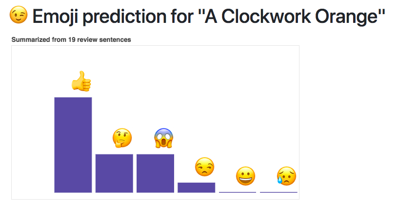

# Mind the Text

## An idea-based search experience

When we interact with the machine or interact with another human through machines, very often our expression is limited to the form of text. This happens when we use keywords to search for items, and  when we read online reviews. 

Using the 1000 fiction best-sellers on audible.com, Mind the Text allow a user to find an audio-book even when they forgot the exact title, and get a quick “emoji “summary of how other people think about this book.

Please check out the [web app here](https://fuzzy-search-app.herokuapp.com/).

### run

 `export FLASK_APP=fuzzy.py`

 and

 `flask run`
